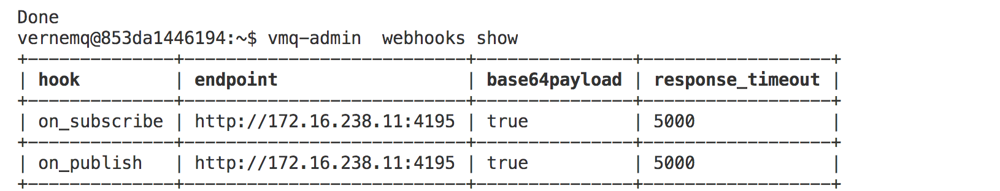
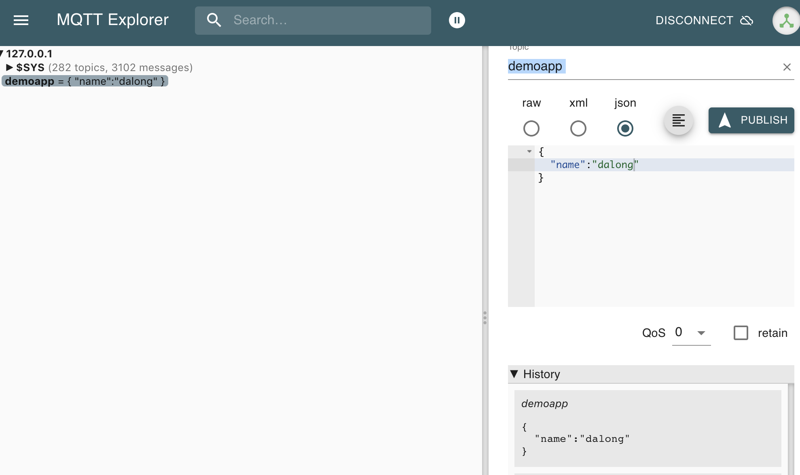
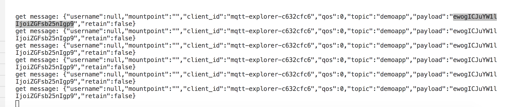

# vernemq webhook learning

> with benthos for webhook server

## Usage

* enable webhook

> inside container (each vernemq node)

```code
vmq-admin  plugin enable --name vmq_webhooks
```

* register hooks

> inside container (each vernemq node )

```code
vmq-admin webhooks register hook=on_publish endpoint="http://172.16.238.11:4195"

vmq-admin webhooks register hook=on_subscribe endpoint="http://172.16.238.11:4195"
```

* view webhook info

> inside container

```code
vmq-admin  webhooks show
```



* send message



* webhook message

>  note payload with base64 encode &&  docker-compose logs -f webhook



